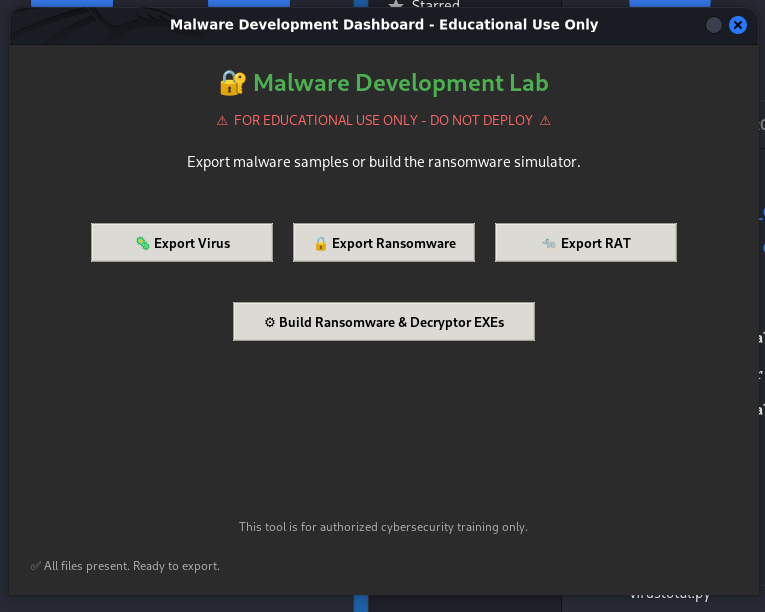

Below is a detailed `README.md` tailored for this educational malware development dashboard. It includes setup instructions, usage guidelines, and a dedicated section for the UI screenshot.

```markdown
# 🛡️ Malware Development Lab – Educational Dashboard



> ⚠️ **STRICTLY FOR EDUCATIONAL AND AUTHORIZED TRAINING PURPOSES ONLY**  
> This project is designed to help cybersecurity students and professionals understand malware behaviour in a **controlled, isolated environment**. Unauthorized deployment or malicious use is illegal and unethical.

---

## 📋 Overview

The **Malware Development Lab** provides a clean, modern graphical interface to:

- Export pre‑built malware samples (Virus, Ransomware, RAT) from a local directory.
- Compile a fully functional **ransomware simulator** and its corresponding **decryptor** into standalone Windows executables using PyInstaller.
- Test encryption/decryption workflows safely inside a virtual machine.

All components are written in Python and leverage `tkinter` for the GUI and `cryptography` for AES‑256 encryption.

---

## ✨ Features

| Component                 | Description                                                                 |
|---------------------------|-----------------------------------------------------------------------------|
| **Dashboard UI**          | Dark‑themed, responsive interface with three export buttons and a build tool.|
| **Placeholder Generation**| Automatically creates dummy `.exe` files if missing, ensuring buttons work.  |
| **Export Functionality**  | "Save As" dialog to copy any sample to a user‑selected location.             |
| **Ransomware Simulator**  | Encrypts all files in its current directory (excluding itself & decryptor).  |
| **Decryptor Tool**        | Restores encrypted files using the same hardcoded AES key.                   |
| **One‑Click EXE Builder** | Compiles the simulator and decryptor into portable `.exe` files via PyInstaller. |

---

## 🧰 Prerequisites

- **Python 3.7+**  
- **pip**  
- Required Python packages (install via `pip`):
  ```bash
  pip install cryptography pyinstaller
  ```
- **Windows OS** (for compiling `.exe` files; the dashboard itself runs on Linux/macOS as well).

---

## 📦 Installation & Setup

1. **Clone or download** this repository to your local machine.

2. **Place all provided files** in the same folder:
   - `maldev.py` (the dashboard)
   - `ransomware_simulator.py`
   - `ransomware_decryptor.py`
   - (Optional) `virus.exe`, `ransomware.exe`, `rat.exe` – the dashboard will create empty placeholders if they are missing.

3. **Install dependencies**:
   ```bash
   pip install -r requirements.txt   # if provided, or manually as above
   ```

4. **Run the dashboard**:
   ```bash
   python maldev.py
   ```

---

## 🖥️ Usage

### 1. Exporting Malware Samples

- Click **🦠 Export Virus**, **🔒 Export Ransomware**, or **🐀 Export RAT**.
- Choose a destination folder and filename.
- The selected sample will be copied to that location.

> **Note:** The ransomware sample exported is the functional simulator (`ransomware.exe`) after it has been built.

### 2. Building the Ransomware Simulator & Decryptor

- Click **⚙️ Build Ransomware & Decryptor EXEs**.
- Confirm the action when prompted.
- The dashboard will invoke PyInstaller to create two standalone executables:
  - `ransomware.exe` – encrypts files in its current directory.
  - `decryptor.exe` – restores files encrypted by the simulator.

Both executables will be placed in the same folder as the dashboard.

### 3. Testing the Ransomware (in a Safe Environment)

- **Always use a dedicated virtual machine with no valuable data.**
- Create a test folder with dummy `.txt`, `.jpg`, etc.
- Copy `ransomware.exe` into that folder and run it.
- All files (except the executables) will be encrypted and renamed with a `.encrypted` extension.
- A pop‑up message will simulate a ransom note.
- To decrypt, copy `decryptor.exe` into the same folder and run it.

---

## 📁 File Structure

```
.
├── maldev.py                    # Main dashboard GUI
├── ransomware_simulator.py      # Source for the encryption payload
├── ransomware_decryptor.py      # Source for the decryption tool
├── virus.exe                    # Placeholder / actual sample
├── ransomware.exe               # Built ransomware executable
├── rat.exe                      # Placeholder / actual sample
├── decryptor.exe                # Built decryptor executable
├── image.png                    # Dashboard screenshot
└── README.md                    # This documentation
```

---

## 🖼️ Dashboard Screenshot

The user interface is designed for clarity and ease of use:


*Main window showing export buttons, build tool, and status bar.*

---

## ⚠️ Important Legal & Ethical Disclaimer

This software is intended **exclusively** for:

- Cybersecurity education
- Controlled penetration testing (with explicit written permission)
- Malware analysis training in isolated lab environments

**Do NOT:**

- Deploy any component on systems you do not own or have explicit authorization to test.
- Use this tool to harm, disrupt, or gain unauthorized access to computer systems.
- Distribute the executables outside of an educational context.

The authors assume **no liability** for misuse. By using this software, you agree to take full responsibility for your actions.

---

## 📜 License

This project is provided for educational purposes under the **MIT License**. See the `LICENSE` file for details (if included). Redistribution and modification are permitted provided the above disclaimer remains intact.

---

## 🙏 Acknowledgements

- [PyInstaller](https://pyinstaller.org/) – for creating standalone executables.
- [cryptography](https://cryptography.io/) – for robust AES encryption.
- The cybersecurity community for promoting responsible research.

```

---

### Notes on Including the Image

- The screenshot `image.png` should be placed in the repository root alongside the `README.md`.
- The Markdown reference `` will render correctly on GitHub, GitLab, or any standard Markdown viewer.
- If you prefer an ASCII representation, you can replace the image line with the text diagram provided, but a real screenshot is more professional.
